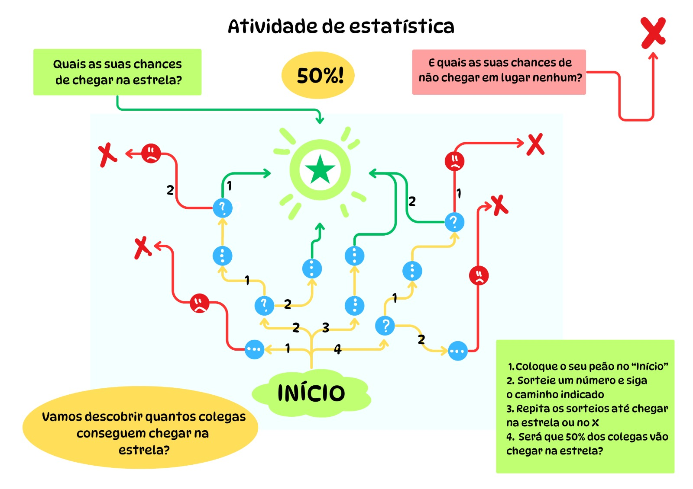
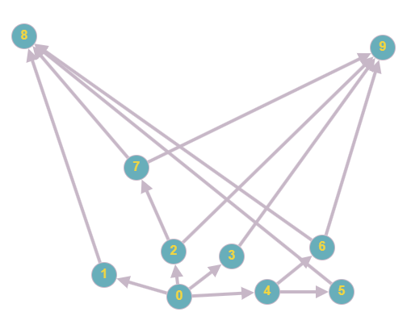

# Probability Game Modeled with Graphs and Monte Carlo Simulation

## Introduction

This project involves a game created as part of a Mathematics Education course, focusing on probability concepts. The game has been modeled using graph theory to represent various game states and interactions. The goal is to simulate the game and analyze its probabilistic properties using the Monte Carlo method.



## Graphs and Adjacency Matrices

### Graphs



Graphs are mathematical structures consisting of a set of vertices (or nodes) connected by edges (or arcs). They are used to model relationships and interactions between entities. In our case, the vertices represent game states, and the edges represent transitions between these states.

### Adjacency Matrices

```
#   0, 1, 2, 3, 4, 5, 6, 7, 8, 9,  
graph = [
    0, 1, 1, 1, 1, 0, 0, 0, 0, 0, # 0
    0, 0, 0, 0, 0, 0, 0, 0, 1, 0, # 1
    0, 0, 0, 0, 0, 0, 0, 1, 0, 1, # 2
    0, 0, 0, 0, 0, 0, 0, 0, 0, 1, # 3
    0, 0, 0, 0, 0, 1, 1, 0, 0, 0, # 4
    0, 0, 0, 0, 0, 0, 0, 0, 1, 0, # 5
    0, 0, 0, 0, 0, 0, 0, 0, 1, 1, # 6 
    0, 0, 0, 0, 0, 0, 0, 0, 1, 1, # 7
    0, 0, 0, 0, 0, 0, 0, 0, 0, 0, # 8
    0, 0, 0, 0, 0, 0, 0, 0, 0, 0, # 9

]
```

An adjacency matrix is a representation of a graph in matrix form. For a graph with \( n \) vertices, the matrix is an \( n \times n \) matrix where the element at position \((i, j)\) indicates the presence or absence of an edge between vertex \( i \) and vertex \( j \). The adjacency matrix is a convenient way to store and manipulate graphs in simulation algorithms.

## Monte Carlo Method

The Monte Carlo method is a statistical technique that uses random sampling to obtain numerical results. In the context of game simulation, it is used to estimate probabilities and behaviors of the game through multiple simulations.

## Code

The following code models the game using an adjacency matrix to represent states and transitions. The Monte Carlo method is then used to simulate the game and calculate the probabilities associated with different states and actions.

O ChatGPT foi usado para compor este texto 😄
